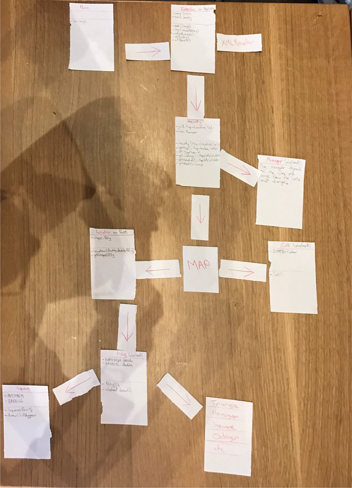
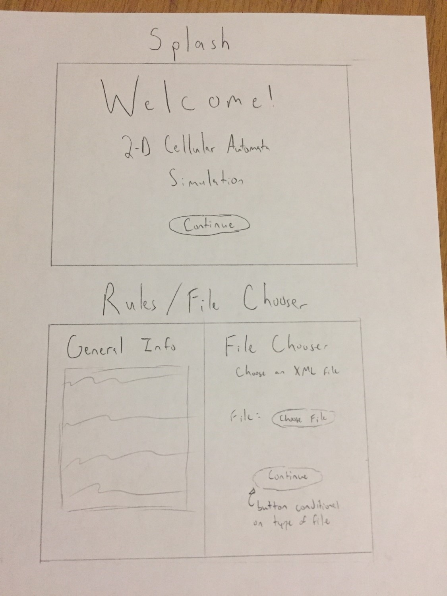
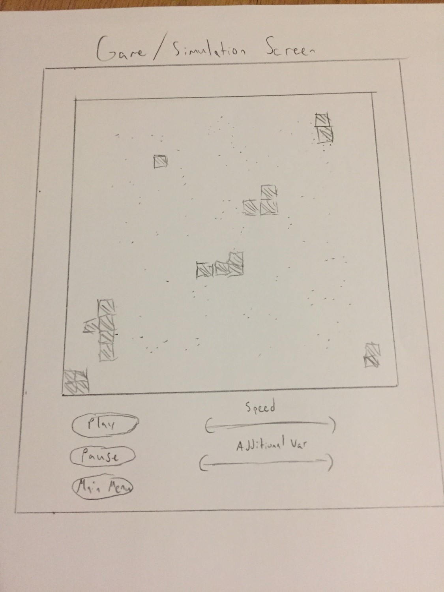

Compsci 308/Spring 17: Cell Society
================

Due Date: 01/28/2017

> This is the link to the assignment: [Cell Society](http://www.cs.duke.edu/courses/compsci308/current/assign/02_cellsociety/)
> This is the link to the prompt for this document: [Design Document](http://www.cs.duke.edu/courses/compsci308/spring17/assign/02_cellsociety/part1_DS8.php)

### Team 13

- Miguel Anderson (mra21)
- Andres Lebbos (afl13)
- Matt Tribby (mrt28)

Introduction
-----
*This section describes the problem your team is trying to solve by writing this program, the primary design goals of the project (i.e., where is it most flexible), and the primary architecture of the design (i.e., what is closed and what is open). This section should discuss the program at a high-level (i.e., without referencing specific classes, data structures, or code).*

 - The goal of this program is to create a 2D grid Cellular Automata simulation. The main scene of the program will contain a grid of cells. The cells will have states (at first, on/alive and off/dead but later more complicated states can be implemented). The cells will read their surrounds and react. Reactions can be, but are not limited to toggling life, moving to a different cell and affecting surround cells. The grid will be the main part of the user interface. In addition, there will be toggles, sliders, and buttons to allow for user input to the application. This will allow users to control the timing of the animation (start, pause, step, speed-up, stop).
 - Our primary design goals are to accommodate any combination of cell-governing rules, any cell shape, any type of cell (meaning any sort of attributes to its identity such as those that affect appearance). We will also be flexible in implementing rules, allowing our simulator to work for a variety of different rules. Another aspect where the project is flexible is related to the tessellations, because the objective of the design is that any tessellation is implementable. We can implement more than a grid of squares!
 - In terms of architecture design, we are open, as just stated, to any tessellation and to any type of rules. We are also open to extensibility to different varieties of cells which will help in being able to implement various games. On the other side, the design is closed in its direct interface and by this it is meant that there will only be one reader (XML) and only one grid and buttons. The design is also closed to modification using modularity because to extend the program you don’t need complete access to the main classes, you just need to extend classes from the current ones. 

Overview
---
*This section serves as a map of your design for other programmers to gain a general understanding of how and why the program was divided up, and how the individual parts work together to provide the desired functionality. As such, it should describe specific components you intend to create, their purpose with regards to the program's functionality, and how they collaborate with each other. It should also include a picture of how the components are related (these pictures can be hand drawn and scanned in, created with a standard drawing program, or screen shots from a UML design program). This section should discuss specific classes, methods, and data structures, but not individual lines of code.*

There will be 4 big sections to this program:

 - Visualization
	 - This is the actual imaging of the grid of cells that make up the 2D simulation.
	 - This program has several classes called Main, Interface, and XMLReader that oversee what the user sees on the screen. Additionally, the main class with the objective to control internally the logic of the automation is based in a class called Society that has a Map that indicates the cells as a data structure and a Manager that is an abstract class dependent on the implementation.
 - User interface / input
	 - The first screen to appear in the user interface is a welcome screen, followed by a screen with general information that contains a file chooser option to read the states of the cells from a predetermined file. Finally, when the file is chosen the user will be shown a screen with the grid (tessellation) with the initial states of all existing cells and a series of buttons that will allow the user to control the animation (start, pause, step, speed-up, stop).
 - Animation control
	 - This section of the program holds the Timeline for the program which will be key in updating the simulation. It will ensure that every cell is updated/checked for an update before changing to the next frame of the animation, thus creating a functioning simulation. 
	 - This will potentially be another class or just methods within interface
 - Reading raw input of initial conditions
	 - The reader implemented by the program is an XML reader. The program will ask the user to select a file (with a file chooser prompt) that the program will read to determine the initial state of the automation.
 - Data structures that hold and control the cells of the game
	 - The main data structure that holds the grid (tessellation) is a Map that contains as a key a Location and as its value a Cell. A Location is, on one hand, a class that extends a Point, but it also has an attribute directly related to Poly which is a regular polygon. The Point part of Location is the mass center of the polygon. On the other side, a Cell is a state that the polygon in that location has and is dependent on the different implementations of the automation. Note: Cell and Poly are abstract classes.

NOTE: UML Design shown in Appendix A.

User Interface
-------
*This section describes how the user will interact with your program (keep it very simple to start). It should describe the overall appearance of program's user interface components and how users interact with these components (especially those specific to your program, i.e., means of input other than menus or toolbars). It should also include one or more pictures of the user interface (these pictures can be hand drawn and scanned in, created with a standard drawing program, or screen shots from a dummy program that serves as an exemplar). Finally, it should describe any erroneous situations that are reported to the user (i.e., bad input data, empty data, etc.). This section should go into as much detail as necessary to cover all your team wants to say.*

 - Opening screen with start button
	 - This will be a simple screen that welcome the users to the simulation platform and provides a single button which will move them into the rule screen.
 - Rules screen (perhaps with a choice to import design of choice)
	 - This screen will have a file selector which allows the user to choose a file from which the XML reader section of our program will interpret to determine the kind of the simulation, the beginning configuration, and any initial parameter settings that may be necessary.
 - Main game screen
	 - Grid: This is just the visual display of all the cells that make up the 2D animation. We have made our design flexible in the shape of the cells.
	 - User input controls (toggles, buttons, sliders). This controls will change basic parts of running the animation such as start, stop, speed up, slow down, and pause.

NOTE: Interfaces shown in Appendix B.

Design Details 
---
*This section describes each component introduced in the Overview in detail (as well as any other sub-components that may be needed but are not significant to include in a high-level description of the program). It should describe how each component handles specific features given in the assignment specification, what resources it might use, how it collaborates with other components, and how each could be extended to include additional requirements (from the assignment specification or discussed by your team). Include the steps needed to complete the Use Cases below to help make your descriptions more concrete. Finally, justify the decision to create each component with respect to the design's key goals, principles, and abstractions. This section should go into as much detail as necessary to cover all your team wants to say.*

 - Main.java
	 - Description: Runs main application
	 - Methods: main(args) - calls Interface
 - Interface.java extends Application
	 - Description: • Contains the javaFX methods of start{}() and step{}() • Loads the screens of menu, rules and game
	 - Methods:
		 - Start(stage)
		 - Step(elapsedTime)
		 - setWelcome() • Creates welcome screen • Has one button that advance to the rules/filepicker
		 - setInfo() • Shows the rules of the game • File picker • XML reader
		 - setGame() • Take Grid from XML Reader  Create Society
	 - Variables:Size
 - XMLReader.java
	 - Description: • Reads an xml file • Outputs Grid as a Map  •
	 - Methods: • Read line by line method • Creates the Map
 - Society.java
	 - Description: • Holds Grid, gets neighbors
	 - Methods: 
		 - society 
		 - getMap() • Return Grid 
		 - setMap(HashMapLocation, Cell> input) • this.Grid = input; 
		 - getSiblings() • Returns map with key as a cell and value as an array  of cells that share only an edge with the key cell 
		 - getRelatives() • Returns map with key as a cell and value as an array of cells that   share only a vertex with the key cell 
		 - getRoot() 
	 - Variables: •   HashMapLocation, Cell> Grid • Related to: • Manager • Locator •
 - Manager.java
	 - Description: • Takes a cell and its neighbors/siblings/relatives and returns the action or change state that should be done to cell.
 -   Locator.java 
	 - Description: • Searches for compatible locations for a cell if it needs relocation
	 - Method: • Takes in cell for relocation • Search for cell
 - Location.java extends Point
	 - Description: • Point + shape
	 - Methods: • draw()
 - Cell.java
	 - Description: • Abstract
		 - A cell has a state, each grid element has a cell (subclasses are the different possible states (alive, dead/empty, burning, tree, etc.)) 
	 - Variables: 
		 - State color
		 - This, at the moment, is the only visual differentiation for a cell’s state. This allows for extension for more states (like   X’s and O’s)
	 - Related to: Society
 - Poly.java
	 - Description: • Abstract
	 - Methods: • draw()
	 - Variables: • Apothem • radius 
	 - Related to: • Assorted polygon classes
 -  Square/Hexagon/Triangle/Octogon and other assorted polygons.java extends Poly
	 - Description: • Subclasses of poly.java
	 - Variables: • Apothem • Radius
   
 
   
  

Design Considerations 
--
*This section describes any issues which need to be addressed or resolved before attempting to devise a complete design solution. It should include any design decisions that the group discussed at length (include pros and cons from all sides of the discussion) as well as any assumptions or dependencies regarding the program that impact the overall design. This section should go into as much detail as necessary to cover all your team wants to say.*

 - Grid of Cells
	 - Will be implementing the grid as a Map but originally, we considered several designs for this key part of our program
	 - Original consideration was for a two-dimensional array. 
	 - Pros: easy search for neighbors of a cell, fast search time if given indices
	 - Con: We deemed it to be inflexible for shapes other than the rectangle i.e. a triangle or a hexagon. 
 - Map design which is our chosen design. 
	 - Pro: Flexible for different sizes of cells (polygons)
	 - Cons: Longer search time for neighbors and not as simple concept wise as a two-dimensional array. 
	 - We ultimately went with this design to maximize the flexibility and extensibility of our program
 - XML Reader
	 - This will read the input .xml file for the shape type, rules of the game and the location of the initial conditions
	 - The main output of this class will be the primary HashMap of our program (HashMap K:Location, V:Cell)
 - Locator class
	 - This class will be called upon if a cell needs relocation elsewhere in the grid that is not in its immediate neighborhood
 - Animation/animator class
	 - We have yet to figure out how to handle the Timeline and whether a class implementation would be easy and helpful to implement.

Team Responsibilities
-------
*This section describes the program components each team member plans to take primary and secondary responsibility for and a high-level plan of how the team will complete the program.*

#### High Level Plan: 
First, we will work to get the fundamentals of this program down. We will work towards implementing the basic version of the Game of Life to ensure that the basic components of our game are clean, efficient, and functioning properly. Throughout this process, we will work together to make sure our individual pieces of code connect efficiently to best serve the overall program. While we are working on this basic implementation we will also all be aware of the importance of the flexibility and extensibility of our code to allows us to easily add on building blocks to the strong foundation we plan on creating. Additionally, we will do our best to make our code clean and readable for our teammates to easily understand it. If they don’t understand our code in our meeting, we will try to refactor it as a group. We will have frequent meetings (at least two a week) to ensure that our code fits well with the overall program and that our program is reaching its goals in the most clean and efficient way possible.

#### Division of Labor: (3 members total)

We will split up the first phase of coding by creating the classes we discussed above. We have split these tasks up by classes that are like each other and how intertwined the classes are with each other. Cells, the polygon classes, Location and Manager are all very related and therefore should be coded concurrently. This is not meant to set the goal of writing the whole class, but to face the classes and see where unanticipated efforts will be needed.

1. cells, polygon classes, location, exceptions
2. XML reader, society,
3. main, start, setWelcome, setInfo, setGame
4. Manager, locator, step

Each one of use will be responsible of coding one of the first three sets of classes. Afterwards we will take the different implementations that are directly related with the fourth category and each one will focus on a direct implementation of those abstract classes to program the different simulations

Use Cases
-------
*The following scenarios are provided to help test the completeness and flexibility of your design. By writing the steps needed to complete each case below you will be able to see how effectively your design handles these scenarios and others will be able to better understand how deeply you have considered the basic issues.*

 - Apply the rules to a middle cell & edge cell
	 - *set the next state of a cell to dead by counting its number of neighbors using the Game of Life rules for a cell in the middle (i.e., with all its neighbors) & set the next state of a cell to live by counting its number of neighbors using the Game of Life rules for a cell on the edge (i.e., with some of its neighbors missing)*
	 - Thanks to our Map structure instead of a 2D Grid, the need for checking for the cases on a border of the board and the middle of the board become one because they have the same method implementations, because a Map has no border at all. The difficulty comes in question when we ask ourselves who are the neighbors of a given Cell if everything is a total disaster in the Map. However, this implementation is not that complicated thanks to a small Math concept: apothem. An apothem, defined on a regular polygon, is the perpendicular distance from its own center to any of its sides. The only job the method of finding the neighbors must ask is if the distance between two centers is the sum of both apothems (each defined by the two figures whose centers are being compared) and if they are the method knows that those two figures are indeed neighbors. Once Society has all the neighbors of a given cell it would create a new subclass of Manager that should be called something along the lines of LifeGame that asks what is the end state of that cell. Finally, Society must add the result that Manager giver to a new map in order for two steps to be simultaneous and at the end it should update the old map with the new one!  
 - Move to next generation
	 - *update all cells in a simulation from their current state to their next state and display the result graphically*
	 - For each cell
		 - use getSiblings()
		 - Passing those siblings (neighbors) into a Manager instance, will return updated cell state for that cell of interest which will be stored
		 - Attributes will be redrawn using the information from the new cell state
	 - After completion of this loop:
		 - This will all be happening in the course of a single cycle of the step() so when the JavaFX scene is updated using Timeline, it will appear as if this switch happened simultaneously 

 - Set simulation parameter
	 - *set the value of a parameter, probCatch, for a simulation, Fire, based on the value given in an XML fire*
	 - XMLReader will read xml file
	 - The first line or lines will be the rules or game being played 
	 - The rest will be, important values as variables, which can be retrieved via a method:
		 - Grid - the initial positions and states of the cells on the 2D grid
		 - Other game parameters, wh ich will be fed to the initialization Manager who control change of game states
			 - probCatch
			 - Etc…

 - Switch simulations
	 - *use the GUI to change the current simulation from Game of Life to Wator*
	 - In the main setGame interface there will be buttons/toggles/sliders around the 2D grid. One of these buttons will be a “Start a New Simulation.” This will have the user pick a new .xml file to import using the same methods as used in the setInfo interface.

### Appendix A:

### Appendix B:

